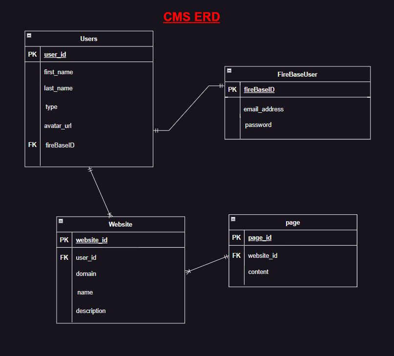

<h1>CMS Website</h1>
This is a Content Management System (CMS) website that allows users to see ready templates and modify them based on their needs. The website is built using React for the front-end, Express.Js for the back-end, and MongoDB for the database.

 

<a href="https://content-hive.onrender.com/">Deployed Link</a>

 

<h2>Getting Started:</h2>
To get started with the CMS website, follow these steps:
 
<ul>
    <li>Clone this Backend repository to your local machine using
        <code>git clone <a href="https://github.com/mohamed-alalwan/CMS_BE.git">https://github.com/mohamed-alalwan/CMS_BE.git</a></code> 
    </li>
    <li>Clone the Front repository to your local machine using
        <code>git clone <a href="https://github.com/mohamed-alalwan/CMS_FE.git">https://github.com/mohamed-alalwan/CMS_FE.git</a></code> 
    </li>
    <li>Install the necessary dependencies by running npm install in both the client and server directories.</li>
    <li>Create a .env file in the server directory with your MongoDB database connection string and other environment variables (e.g. PORT for the server, and firebase service account details).</li>
    <li>Start the development server by running npm start in both the client and server directories.</li>
</ul>
 
<h2>Features</h2>
<h3>The CMS website comes with the following features:</h3>
<ul>
    <li>Ready templates: Users can see a list of pre-made templates to choose from.</li>
    <li>Template customization: Users can modify the templates based on their needs by changing the content and layout.</li>
    <li>Role Based Firebase authentication: Customers and Administrators.</li>
    <li>Customers can sign up and log in to their accounts to save their customized templates.</li>
    <li>Administrators can manage users and websites.</li>
    <li>Database integration: The website uses MongoDB to store user data and template information.</li>
</ul>
 
<h2>Tools and Technologies</h2>
<h3>The CMS website was built using the following tools and technologies:</h3>
<ul>
    <li>React: A JavaScript library for building user interfaces.</li>
    <li>Express.Js: A minimal and flexible Node.js web application framework.</li>
    <li>MongoDB: A NoSQL document database for storing and retrieving data.</li>
    <li>Firebase: A platform for building mobile and web applications without managing servers.</li>
    <li>Studio3T: A MongoDB IDE for developing and managing databases.</li>
    <li>VScode: A source code editor developed by Microsoft for Windows, Linux, and macOS.</li>
    <li>GitHub: A web-based hosting service for version control using Git.</li>
</ul>
 
Contributing
 
If you'd like to contribute to the CMS website, feel free to fork this repository and submit a pull request with your changes. Make sure to follow the contributing guidelines and code of conduct.
contact through mebrahim6077@gmail.com, mohamedalalwan98@gmail.com or contact us on github.com.
  
<h2>ERD:</h2>

